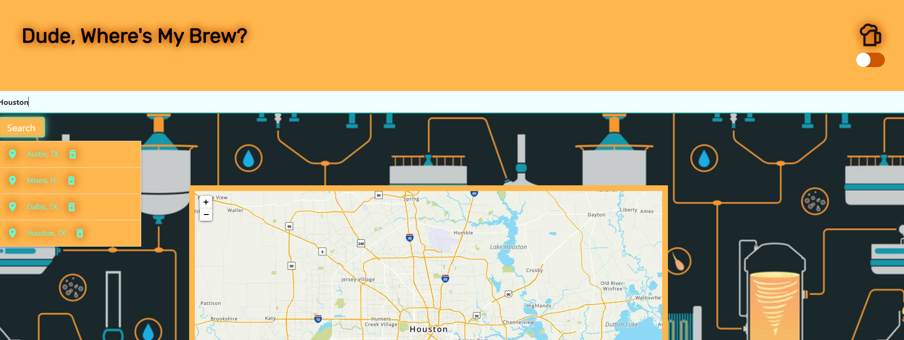

# DudeWheresMyBrew
Project Title: Dude-WheresMyBrew

## Descrption

Description: Be able to find local or search breweries around using Mapquest and OpenBreweryDB APIs.

We have created a brewery finder that will allow you to search a city and find local breweries, cideriers, or bottleshops. You can choose your current location or you can search any city so you can plan a night out with your friends. When you search for a city, the city is saved and displayed as a button so that if you want to search for that cities breweries, cideriers, or bottleshops, all you have to do is click on it to have the locations displayed again.

## Images

## Links

[github repository:](https://github.com/FractalIceCream/DudeWheresMyBrew)

[project website:](https://fractalicecream.github.io/DudeWheresMyBrew/)

[OpenBreweryDB API:](https://www.openbrewerydb.org/)

[Mapquest API](https://developer.mapquest.com/documentation)

[Vincent's GitHub](https://github.com/FractalIceCream)

[Allex's GitHub](https://github.com/allexortiz)

[Ernest's GitHub](https://github.com/ernestbeecherl)

[Lindsay's GitHub](https://github.com/Lindsayagreen)

[Eliseo's GitHub](https://github.com/lsaox)

## User Story

AS A user
I WANT to see the nearest locations of breweries, cideriers, or bottleshops.
SO THAT I can go and checkout drinking at local business and special craft brews.

## Acceptance Criteria

GIVEN a map interface with searching functionality 
WHEN I search for a city
THEN I am presented with map visual of the city and log the user's city in the search history and in local storage
WHEN I select a previous searched city
THEN I am presented with an update to the map of that city, and presented an option to select and show breweries
WHEN I select to show breweries
THEN I am presented with a corresponding number of marker locations of breweries around the city by distance
WHEN I select to show breweries again
THEN I am presented with options to view additional up to 20 breweries on the map
WHEN I select a location pin on the map
THEN I am presented with a popup detailing the location's address, brewery name, and if any, a link to their website.
WHEN I select the toggle on the upper right corner
THEN I am presented with a color scheme representing from light mode to dark mode and vice-versa
WHEN I select the trash can icon adjacent to it's city
THEN I am presented the removal of that city from the search history and local storage
THEN I am again presented with current and future conditions for that city

